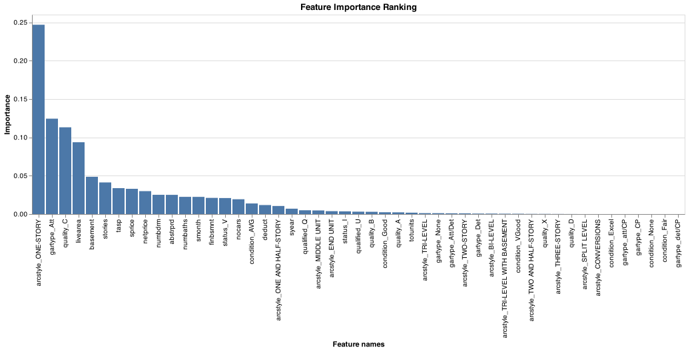

## Project 4

__Kwaku Appau-Nkansah__

#### Elevator pitch
The clean air act of 1970 was the beginning of the end for the use of asbestos in home building. By 1976, the U.S. Environmental Protection Agency (EPA) was given authority to restrict the use of asbestos in paint. Homes built during and before this period are known to have materials with asbestos https://www.asbestos.com/mesothelioma-lawyer/legislation/ban/.

The state of Colorado has a large portion of their residential dwelling data that is missing the year built and they would like a predictive model that can classify if a house is built pre 1980. They would also like a model that predicts (regression) the actual age of each home.

Home sales data for the city of Denver from 2013 has been provided to train the model. The latest machine learning methods will be used to solve these grand questions:

1. Charts that evaluate potential relationships between the home variables and before1980.

2. Classification model (before or after 1980) that has at least 90% accuracy for the state of Colorado to use (explain your model choice and which models you tried)?

3. The most important features in your model (Justification)?

4. Quality of the classification model using evaluation metrics.

----

## Report

#### Potential relationships between the home variables and before1980

From the chart above, we can notice that on an average, houses built before 1980 represented by '1' on the graph had lesser total square footage than those built after 1980 (represented by '0')

From the graph, we see that if a house is a one story arc style, it was likely to be built before 1980

<!--  -->

<!-- The graph reveals that if there are about 4 car spaces in a house, it was likely built before 1980 -->

---

#### Classification model accuracy

The classification model that was used was the DecisionTreeClassifier() which produced a 0.9006546014632268%. This was above the 90% requirement

---

#### Most important features

From the bar chart above, we can see that the four most important features are 'arcstyle_ONE-STORY', 'gartype_Art', 'quality_C', and 'livearea'. In effect, the model is likely to predict the year a house was built based on these features.

---

#### Quality of model

| Precision  |   Recall |   Accuracy    |
|:-----------|---------:|--------------:|
| 0.85       |     0.88 |      0.90     |

The metrics being used for the justification are Recall, Precision and Accuracy.

__Recall__ is the ability of your model to find all the relevant cases in the model. It answers the question "What proportion of actual possitives was identified correctly?" From our model, we get 88% recall. This is calculated as __Number of true positives / (Number of true positives + Number of False Negatives)__ 2544 / (2544 + 340) = 0.88210818.

__Precision__ is the ability of a model to identify only the relevant data points. This would answer the question "What proportion of positive identifications was actually correct?". From our model, we get 85%. This is calculated as __Number of true positives / (Number of true positives + Number of false positives)__ 2544 / (2544 + 434) = 0.85426461.

__Accuracy__ is the fraction of the prediction the model gets right. It is the simple calculation where you divide the number of data points evaluated correctly by the number of total data points.
(2544 + 4473) / (2544 + 340 + 4473 + 434) = 0.9006546.

---

## APPENDIX A (PYTHON SCRIPT)
